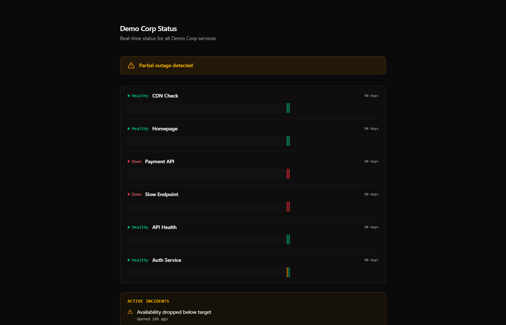
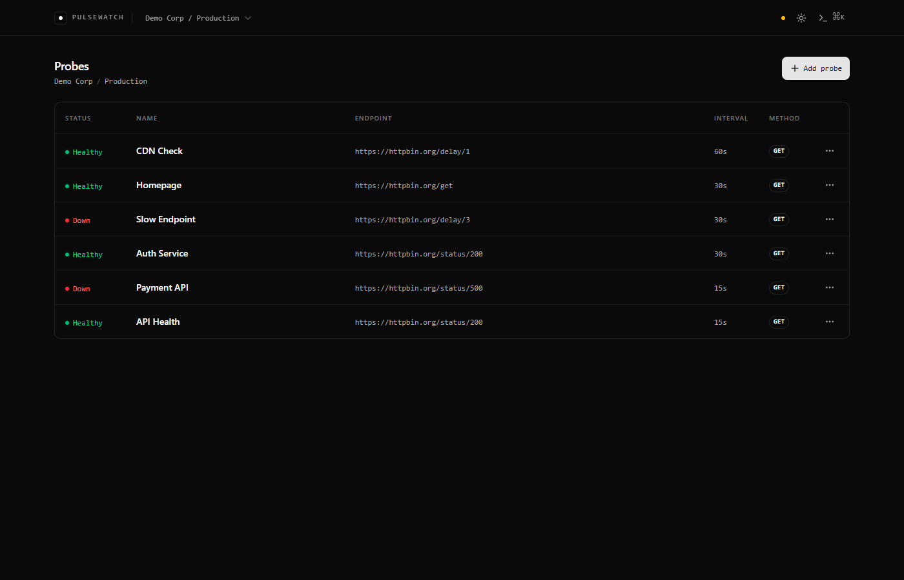
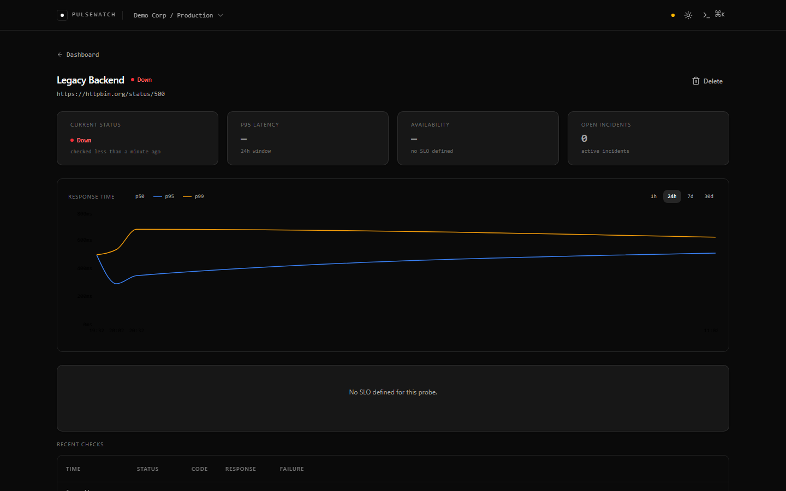
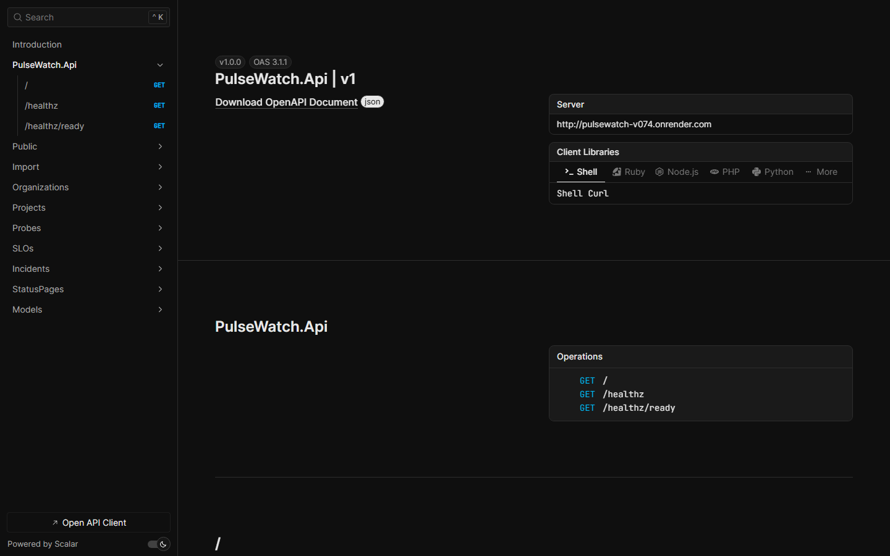

# PulseWatch

**Self-hosted reliability dashboard. Probes, SLOs, public status pages — without the SaaS bill.**

[](LICENSE)
[](https://dotnet.microsoft.com)
[](https://react.dev)
[](#run-tests)

🔗 **Live demo:** [pulsewatch.onrender.com](https://pulsewatch.onrender.com) &nbsp;|&nbsp; 📊 **Status page:** [pulsewatch.onrender.com/p/demo](https://pulsewatch.onrender.com/p/demo)

---

<p align="center">
  
</p>

<p align="center">
  
</p>

<p align="center">
  
</p>

---

## Why

Better Stack costs $29/month. Datadog costs $300/month. Uptime Kuma is great but has no SLOs, no REST API, no config-as-code. PulseWatch fills the gap: SRE-grade tracking with one `docker compose up`.

## Features

- **HTTP probes** with configurable assertions — status code, latency threshold, body regex, JSON path
- **SLO tracking** — availability, error budget burn rate, projected exhaustion over 7/30-day windows
- **Incident autodetection** — opens when availability drops below target, closes on recovery
- **Public status pages** — 90-day historical bars, incident timeline, custom slug (`/p/<slug>`)
- **YAML config-as-code** — define probes, SLOs, and status pages in `pulsewatch.yaml`; import via API
- **Real-time dashboard** via SignalR — no polling, no F5
- **REST API + OpenAPI** — full API surface at `/scalar`
- **Multi-tenancy** — Organizations → Projects → Probes
- **Self-instrumented** — OpenTelemetry traces + `/metrics` Prometheus endpoint

## Quick start

```bash
docker compose up -d
# Backend: http://localhost:8080
# Frontend: http://localhost:5173
```

Or run locally without Docker:

```bash
# Start Postgres
docker run --name pulse-pg \
  -e POSTGRES_PASSWORD=dev -e POSTGRES_DB=pulsewatch \
  -p 5499:5432 -d postgres:16

# appsettings.Local.json (gitignored):
# { "ConnectionStrings": { "Postgres": "Host=localhost;Port=5499;Database=pulsewatch;Username=postgres;Password=dev" } }

dotnet run --project src/PulseWatch.Api
cd client && npm install && npm run dev
```

Backend: `http://localhost:5035` · Frontend: `http://localhost:5173` · Scalar: `http://localhost:5035/scalar`

## Configuration as code

```yaml
version: 1
project:
  name: My Services
  slug: my-services
probes:
  - name: API
    url: https://api.example.com/health
    interval: 30s
    assertions:
      - status: 200
      - latency_p95_ms: 500
slos:
  - probe: API
    target_availability: 99.9
    window: 30d
status_pages:
  - slug: demo
    title: My Services Status
    probes: [API]
```

```bash
curl -X POST localhost:5035/api/v1/yaml-import \
  -H 'Content-Type: text/yaml' \
  --data-binary @pulsewatch.yaml
```

## Create a probe manually

```bash
ORG=$(curl -s -X POST localhost:5035/api/v1/organizations \
  -H 'Content-Type: application/json' \
  -d '{"name":"My Org","slug":"my-org"}' | jq -r .id)

PROJ=$(curl -s -X POST localhost:5035/api/v1/organizations/$ORG/projects \
  -H 'Content-Type: application/json' \
  -d '{"name":"My Project","slug":"my-project"}' | jq -r .id)

curl -s -X POST localhost:5035/api/v1/projects/$PROJ/probes \
  -H 'Content-Type: application/json' \
  -d '{
    "name": "API Health",
    "url": "https://api.example.com/health",
    "intervalSeconds": 30,
    "assertions": [
      { "type": "StatusCode", "operator": "Equals",   "expectedValue": "200" },
      { "type": "LatencyMs",  "operator": "LessThan", "expectedValue": "500" },
      { "type": "JsonPath",   "operator": "Equals",   "expectedValue": "ok",
        "jsonPathExpression": "$.status" }
    ]
  }'
```

## Architecture

```
ProbeScheduler (5 s tick)
    │
    │  Channel<ProbeJob> — bounded 1000, DropWrite
    ▼
ProbeWorker ×4 (concurrent)
    │  HTTP probe + assertion evaluation
    │
    ├─ HealthCheck row ──┐
    └─ OutboxMessage row─┤  single transaction
                         │
                    OutboxRelay (200 ms poll, FOR UPDATE SKIP LOCKED)
                         │
                    SignalR hub → browser (live dashboard)
                    IMemoryCache invalidation → status page snapshots

RollupRefresher (60 s)
    └─ REFRESH MATERIALIZED VIEW CONCURRENTLY (health_check_1m/1h/1d)

SloCalculator (60 s)
    └─ reads health_check_1h/1d → writes SloMeasurement + auto-opens/closes Incidents
```

**Assertion engine:** `ProbeWorker` dispatches to `StatusCodeEvaluator`, `LatencyEvaluator`, `BodyRegexEvaluator`, or `JsonPathEvaluator`. All assertions must pass for `IsSuccess = true`.

Architecture Decision Records:
- [ADR 001 — Transactional Outbox](docs/adr/001-outbox-pattern.md)
- [ADR 002 — Channel Pipeline](docs/adr/002-channel-pipeline.md)
- [ADR 003 — PostgreSQL Rollups vs TimescaleDB](docs/adr/003-postgres-rollups-vs-timescale.md)

## Stack

**Backend** — .NET 10, ASP.NET Core Minimal API, EF Core 9, SignalR, PostgreSQL, Serilog  
**Frontend** — React 18, TypeScript, Vite, TanStack Query, shadcn/ui, Tailwind, recharts  
**Observability** — OpenTelemetry (traces + metrics), Prometheus `/metrics`, Scalar OpenAPI UI  
**Tests** — xunit, FluentAssertions, Testcontainers (PostgreSQL), WireMock.Net

<p align="center">
  
</p>

## Run tests

```bash
dotnet test
```

Unit tests: < 1 s. Integration tests (Testcontainers): ~30 s.

## Roadmap

- Slack/Discord webhook on SLO breach
- Distributed probing from multiple regions
- Synthetic transactions (multi-step, Playwright-style)
- On-call rotation

## License

[MIT](LICENSE)
